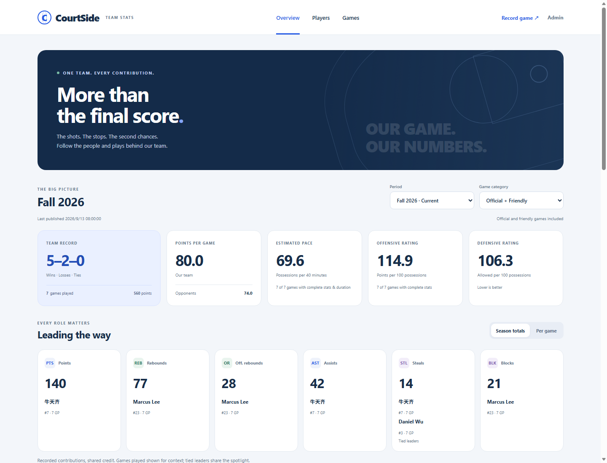
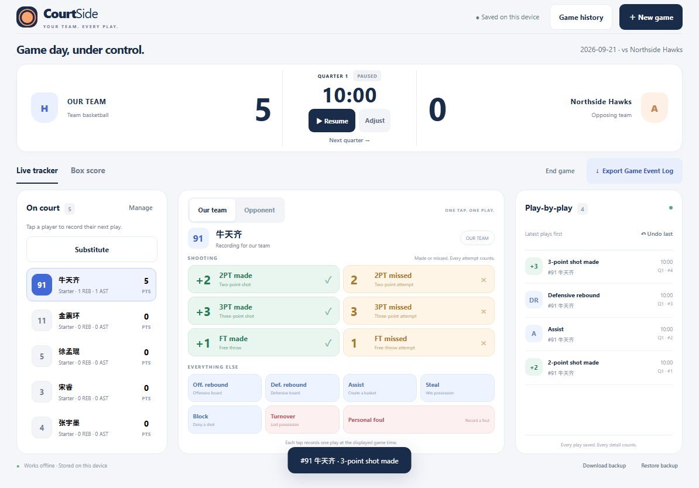
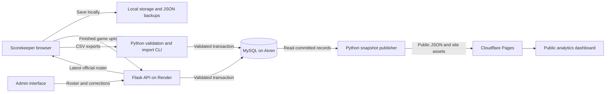

# CourtSide

### From courtside events to trustworthy team analytics

**An end-to-end data engineering and full-stack project built for a university basketball team.** CourtSide turns live game actions into validated records in MySQL, then publishes player and team statistics through a public dashboard. It connects offline browser capture, Python ingestion, relational data modeling, a Flask API, and cloud deployment in one working system.

**[Live dashboard](https://courtside-team.pages.dev/) · [Scorekeeper](https://courtside-team.pages.dev/Front) · [Architecture](#architecture) · [Engineering highlights](#engineering-highlights) · [Run locally](#run-locally)**

**Core stack:** Python · SQL / MySQL · Flask · JavaScript · HTML / CSS · Docker · Gunicorn · Cloudflare Pages · Render · Aiven

## Project at a glance

| | |
| --- | --- |
| **Problem** | Game recording, roster changes, corrections, and statistics need a consistent source of truth, even when courtside connectivity is unreliable. |
| **Solution** | Capture plays locally, validate and store complete game uploads transactionally, and publish a separate dataset for public analytics. |
| **My engineering scope** | Data contracts, ingestion and validation, SQL schema and migrations, backend APIs, browser state management, analytics, automated testing, and deployment configuration. |
| **Users** | Scorekeepers record games; an admin manages the official record; teammates and visitors explore results without signing in. |
| **Primary focus** | Data integrity, reproducible calculations, recoverable failures, and an interface people can use during a game. |

## See the product

**Public analytics:** season, year, and career filters; player leaders; searchable profiles; shooting splits; and game reports.



<details>
<summary><strong>View the courtside recording interface</strong></summary>



The recorder supports 13 event types, both teams' statistics, substitutions, playing-time tracking, corrections, and CSV/JSON exports. Its standalone build works offline without external scripts or stylesheets.

</details>

*Screenshots use demonstration game data. They illustrate the implemented UI, not measured team performance.*

## Skills demonstrated

| Area | What I implemented | Where to inspect it |
| --- | --- | --- |
| **Data engineering / ETL** | CSV ingestion, explicit data contracts, UTF-8 and timestamp normalization, full-file validation, duplicate-safe imports, and atomic participation snapshots. | [Validation](scorekeeper_pipeline/validation.py), [pipeline CLI](scorekeeper_pipeline/__main__.py), [import logic](scorekeeper_pipeline/database.py) |
| **SQL and relational modeling** | Stable player identities, event-level records, composite keys, foreign keys, check constraints, indexes, historical snapshots, and additive migrations. | [Core schema](sql/schema.sql), [remote schema](sql/remote.sql), [analytical SQL](sql/queries.sql) |
| **Backend engineering** | Flask REST endpoints, separate scorekeeper/admin permissions, signed expiring sessions, atomic uploads, optimistic concurrency, and correction audit history. | [API](scorekeeper_remote/app.py), [authentication](scorekeeper_remote/auth.py), [repository](scorekeeper_remote/repository.py) |
| **Analytics engineering** | Defined metric denominators, appearance-based averages, weighted shooting rates, season/category filtering, and completeness checks for pace and efficiency estimates. | [Statistics](scorekeeper_remote/statistics.py), [dashboard calculations](site/analytics.js), [metric definitions](docs/public-dashboard.md) |
| **Frontend engineering** | Responsive tablet/mobile layouts, event-driven recording, elapsed-time clocks, local persistence, backup recovery, and synchronization with the Admin roster. | [Game engine](src/engine.js), [roster/lineup engine](src/team.js), [browser application](src/app.js) |
| **Cloud and deployment** | A Dockerized Python service, managed MySQL with verified TLS, static site publication, environment-based configuration, and deployment documentation. | [Dockerfile](Dockerfile), [Render configuration](render.yaml), [publisher](scorekeeper_remote/publishing.py), [deployment guide](docs/remote-deployment.md) |
| **Quality and reliability** | Unit tests, API tests, isolated MySQL integration tests, and real-browser checks for retries, corrections, offline recording, persistence, and responsive layouts. | [Test suites](tests), [MySQL test runner](tests/run_mysql_tests.py), [browser regression tests](tests/browser-remote.cjs) |
| **Product and technical communication** | Separate recording, administration, and public-viewing workflows; documented schemas, operating procedures, metric definitions, and design decisions. | [User guide](docs/scorekeeper-guide.md), [API guide](docs/remote-api.md), [design documents](docs/superpowers/specs) |

## Architecture



There are two ingestion paths: authenticated game uploads for everyday use and a Python CSV pipeline for local imports. Both validate data before persistence. The public dashboard reads a published JSON snapshot, so visitors do not need a live database connection or an awake backend.

Database writes and publication are separate outcomes. A successful save remains committed if publishing fails; the admin can retry publication without submitting the game again. The hosted service publishes the current database snapshot together with the frontend assets.

## Engineering highlights

### 1. Reliable ingestion with explicit failure behavior

The event pipeline validates types, game identity, player attribution, event codes, points, dates, and timestamps before writing. Invalid input rejects the complete file with a row-level explanation. Supported cleanup is explicit; missing values and inconsistent records require correction at the source.

The database uses an InnoDB transaction for each event import and locks the game row to serialize imports for the same game. Any conflict or database failure rolls back the transaction.

**Example:** importing the same game twice does not double its score. `(game_id, event_id)` identifies each play. An older export cannot reactivate an already-voided play, and a conflicting event payload is rejected.

### 2. Historical accuracy while the roster changes

Player IDs are independent of names and jersey numbers. The official roster stores current details, while game events and participation retain historical names and numbers.

The hosted scorekeeper checks the Admin roster on opening and before creating a game. Official selection excludes obsolete built-in defaults; local-only identities remain in JSON backups. Unstarted games refresh their choices, while started games retain their player identities and recorded minutes. A failed roster check keeps the saved data and reports that freshness could not be verified.

### 3. Retry safety and auditable corrections

A pending upload retains its exact payload across retries. Ambiguous network failures keep the game locked for retry instead of assuming the server rejected it. The backend recognizes duplicate submissions, and admin corrections require the expected game version to prevent stale edits from overwriting newer ones.

Voided plays remain in the event log, and administrative changes preserve prior documents in an audit table. Participation snapshots carry a revision and content hash so stale or conflicting snapshots cannot silently replace newer playing-time data.

### 4. Analytics that account for missing data

Games played comes from participation, including zero-stat appearances and excluding unused bench players. Shooting percentages divide total makes by total attempts. Aggregate pace and ratings use eligible possessions and duration.

Missing opponent detail stays unavailable rather than becoming zero. Partial playing time is labeled, and pace/efficiency estimates require sufficient recording coverage. [Read the metric definitions and eligibility rules.](docs/public-dashboard.md#metric-definitions)

### 5. Practical cloud and security boundaries

Public readers use static files, while authenticated writes go through the API. The application separates scorekeeper and admin permissions, limits failed PIN attempts, uses expiring signed sessions, and keeps credentials out of published assets. Remote MySQL connections verify the TLS certificate and hostname.

The deployment targets one team and free-tier hosting. Backend cold starts and offline devices are handled through visible status, local saving, and retries. The release workflow deploys the backend on Render, then publishes the website and database snapshot to Cloudflare Pages.

## Data model

| Table | Grain and purpose |
| --- | --- |
| `players` | One permanent player identity; current roster attributes. |
| `games` | One game; stable ID, date, and opponent. |
| `events` | One recorded play per `(game_id, event_id)`; historical player details and void status. |
| `game_participation` | One game/player record; designated status, starts, appearances, and playing milliseconds. |
| `participation_snapshots` | One participation revision per game; coverage and content hash. |
| `remote_uploads` | One remote upload record per game; version, original hash, payload, and deletion state. |
| `remote_audit` | Prior documents retained for administrative changes. |
| `remote_game_details` | Game category, duration, and recording completeness. |
| `remote_publication` | Publication revision and status, separate from successful database writes. |

The [SQL schema](sql/schema.sql) and [remote extensions](sql/remote.sql) define the relationships and constraints. The [pipeline guide](docs/mysql-pipeline.md) explains imports, conflict handling, migration behavior, and example queries.

## Run locally

### Try the scorekeeper

```sh
git clone https://github.com/BarryNiu-Wahaha/Courtside-Scorekeeper.git
cd Courtside-Scorekeeper
python -m http.server 8000 --bind 127.0.0.1
```

Open **http://127.0.0.1:8000/Front.html**. No database or API credentials are needed for local recording. You can also open `Front.html` directly in a desktop browser.

Create a game, select 5–15 squad members and five starters, then start the clock and record plays. Use **Download backup** to preserve the browser's workspace. The [user guide](docs/scorekeeper-guide.md) covers recording, corrections, CSV contracts, and recovery.

### Explore the Python ingestion pipeline

Python 3.12 and Node.js 24 match the container's runtimes. The browser app itself does not require Node.

```sh
python -m pip install -r requirements.txt
python -m scorekeeper_pipeline validate path/to/game_events.csv
```

Validation does not need a database. To create a local MySQL schema and import the validated file:

```sh
python -m scorekeeper_pipeline init-db --user YOUR_MYSQL_USER
python -m scorekeeper_pipeline import path/to/game_events.csv --user YOUR_MYSQL_USER
```

Credentials are supplied through the terminal or environment, not committed files. For an existing database, use the documented migration command instead of assuming initialization upgrades its schema. See [local pipeline setup](docs/mysql-pipeline.md) and [hosted API setup](docs/remote-api.md).

## Testing and verification

The tests exercise data integrity and recovery behavior as well as calculations:

- Duplicate and conflicting imports, rollback, concurrent writes, and additive migrations against an isolated MySQL instance.
- Invalid API input, role boundaries, corrections, publication failure, and unchanged retry payloads.
- Roster synchronization, starter preservation, clock expiry, substitutions, voided plays, and backup restoration.
- Dashboard filters, missing metrics, guest aggregation, zero-stat appearances, and responsive browser layouts.

```sh
# JavaScript unit tests
node --test tests/engine.test.cjs tests/team.test.cjs tests/remote.test.cjs tests/analytics.test.cjs

# Python validation, API, publication, and analytics tests
python -m unittest discover -s tests -p "test_*.py" -v

# Build the standalone UI and exercise it in a real browser
node build.cjs
node tests/browser-smoke.cjs
```

Python discovery skips database integration cases unless their test environment is configured. Run `python tests/run_mysql_tests.py` for the isolated database suite; it requires an installed MySQL server binary (`MYSQLD_PATH`). Browser tests use Microsoft Edge on Windows or a Chromium executable set through `EDGE_PATH`. See the [deployment guide](docs/remote-deployment.md#working-locally) for hosted browser-test build commands. Real iPad Safari/touch validation remains a separate device check.

## Explore the repository

```text
src/                    Browser game engine, roster logic, persistence, and UI
site/                   Public dashboard, analytics, and admin interface
scorekeeper_pipeline/   CSV validation, import CLI, and MySQL transactions
scorekeeper_remote/     Flask API, authentication, repository, and publication
sql/                    Schema, migrations, constraints, and analytical queries
tests/                  Unit, API, MySQL integration, and browser tests
docs/                   User guides, data contracts, design, and deployment notes
```

**Documentation:** [Scorekeeper guide](docs/scorekeeper-guide.md) · [Roster and lineups](docs/roster-lineups.md) · [CSV → MySQL pipeline](docs/mysql-pipeline.md) · [API setup](docs/remote-api.md) · [Dashboard metrics](docs/public-dashboard.md) · [Cloud deployment](docs/remote-deployment.md)
